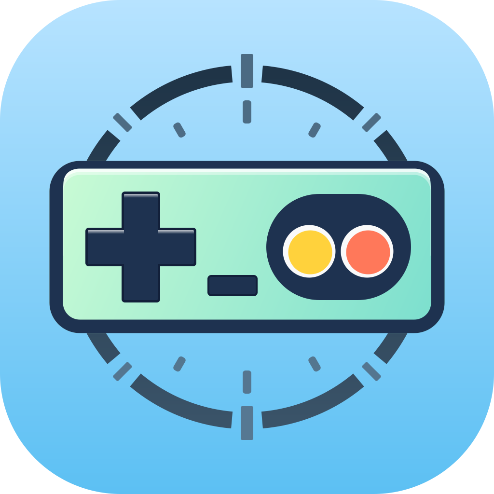

#  Nesium

  
  
  

[**中文说明**](./README_zh.md)

A cycle-accurate NES emulator written in Rust, designed to faithfully replicate the behavior of the Nintendo Entertainment System hardware. This project strives to provide precise emulation of the CPU, PPU, APU, and other critical components, ensuring that every game runs as it would on the original hardware.

This emulator’s design and implementation draw heavily from the excellent [Mesen2](https://github.com/SourMesen/Mesen2) project. Mesen2’s documentation, code structure, and many of its implementation ideas (especially around timing, open-bus behaviour, and audio mixing) have been an invaluable reference. Huge thanks to the Mesen2 authors and contributors for making such a high‑quality emulator available.

## Key Features

- **Cycle-accurate emulation**: Every clock cycle is emulated precisely to ensure accurate game behavior.
- **CPU (6502) Emulation**: Full emulation of the 6502 processor with support for all instructions.
- **PPU Emulation**: Accurate rendering of graphics, including support for palettes, sprites, and background layers.
- **APU Emulation**: Recreates sound processing with support for the NES sound channels.
- **Compatibility**: Supports a variety of NES games, with ongoing improvements to compatibility and performance.

## UI frontends

This repository currently ships **two** UI frontends:

- **`nesium-egui`** (`apps/nesium-egui`) — A lightweight desktop frontend built with `egui`. It has a small footprint and provides the essentials for **quick debugging and development**.
  -   
- **`nesium-flutter`** (`apps/nesium_flutter`) — A modern frontend built with **Flutter**. It aims for a more polished UI and broader cross‑platform reach than the `egui` app.
  -     
- **Web build (play online)** — https://mikai233.github.io/nesium/ (Runs in the browser via high-performance **Flutter WASM (dart2wasm)** + Web Worker + Rust WASM).
  -  (Chrome/Edge 119+, Firefox 120+)

## Current Status

- Active development with ongoing improvements to accuracy, performance, and compatibility.
- Still in the early stages, but several key components are already functional.

## Roadmap

The long-term vision for Nesium focuses on precision, tooling, and extensibility:

- [ ] **Accurate NES Emulation**:  
    Achieve cycle-perfect accuracy across CPU, PPU, and APU components. The goal is to pass all standard compliance suites (including tricky edge cases in `blargg`'s tests and `nes-test-roms`) and support "unlicensed" or hardware-quirk-dependent titles correctly.

- [ ] **Advanced Debugging Suite**:  
    Implement a comprehensive debugger within the frontend. Planned features include:
    - Real-time disassembly and stepping.
    - Memory inspection/editing (RAM, VRAM, OAM).
    - Nametable, Pattern Table, and Palette viewers.
    - Breakpoint management (execution, read/write, IRQ).

- [ ] **Lua Scripting Integration**:  
    Embed a Lua runtime to enable powerful automation and analysis. This will support:
    - Tool-Assisted Speedrun (TAS) workflows.
    - Custom HUDs and overlays for training or streaming.
    - Automated regression testing scripts.

- [ ] **Netplay**:
    Implement networked multiplayer support for two-player games over the internet.

## Mapper support

### Plane 0 (iNES 1.0 mappers 0-255)

| Row     | 0    | 1    | 2    | 3    | 4    | 5    | 6    | 7    | 8    | 9    | A    | B    | C   | D    | E    | F   |
|---------|------|------|------|------|------|------|------|------|------|------|------|------|-----|------|------|-----|
| 000-015 | ☑000 | ☑001 | ☑002 | ☑003 | ☑004 | ☑005 | ☑006 | ☑007 | ☑008 | ☑009 | ☑010 | ☑011 | 012 | ☑013 | 014  | 015 |
| 016-031 | 016  | 017  | 018  | ☑019 | 020  | ☑021 | 022  | ☑023 | 024  | ☑025 | ☑026 | 027  | 028 | 029  | 030  | 031 |
| 032-047 | 032  | 033  | ☑034 | 035  | 036  | 037  | 038  | 039  | 040  | 041  | 042  | 043  | 044 | 045  | 046  | 047 |
| 048-063 | 048  | 049  | 050  | 051  | 052  | 053  | 054  | 055  | 056  | 057  | 058  | 059  | 060 | 061  | 062  | 063 |
| 064-079 | 064  | 065  | ☑066 | 067  | 068  | ☑069 | 070  | ☑071 | 072  | 073  | 074  | 075  | 076 | 077  | ☑078 | 079 |
| 080-095 | 080  | 081  | 082  | 083  | 084  | ☑085 | 086  | 087  | 088  | 089  | ☑090 | 091  | 092 | 093  | 094  | 095 |
| 096-111 | 096  | 097  | 098  | 099  | 100  | 101  | 102  | 103  | 104  | 105  | 106  | 107  | 108 | 109  | 110  | 111 |
| 112-127 | 112  | 113  | 114  | 115  | 116  | 117  | 118  | ☑119 | 120  | 121  | 122  | 123  | 124 | 125  | 126  | 127 |
| 128-143 | 128  | 129  | 130  | 131  | 132  | 133  | 134  | 135  | 136  | 137  | 138  | 139  | 140 | 141  | 142  | 143 |
| 144-159 | 144  | 145  | 146  | 147  | 148  | 149  | 150  | 151  | 152  | 153  | 154  | 155  | 156 | 157  | 158  | 159 |
| 160-175 | 160  | 161  | 162  | 163  | 164  | 165  | 166  | 167  | 168  | 169  | 170  | 171  | 172 | 173  | 174  | 175 |
| 176-191 | 176  | 177  | 178  | 179  | 180  | 181  | 182  | 183  | 184  | 185  | 186  | 187  | 188 | 189  | 190  | 191 |
| 192-207 | 192  | 193  | 194  | 195  | 196  | 197  | 198  | 199  | 200  | 201  | 202  | 203  | 204 | 205  | 206  | 207 |
| 208-223 | 208  | 209  | 210  | 211  | 212  | 213  | 214  | 215  | 216  | 217  | 218  | 219  | 220 | 221  | 222  | 223 |
| 224-239 | 224  | 225  | 226  | 227  | ☑228 | 229  | 230  | 231  | 232  | 233  | 234  | 235  | 236 | 237  | 238  | 239 |
| 240-255 | 240  | 241  | 242  | 243  | 244  | 245  | 246  | 247  | 248  | 249  | 250  | 251  | 252 | 253  | 254  | 255 |

### Plane 1 (NES 2.0 mappers 256-511)

| Row     | 0   | 1   | 2   | 3   | 4   | 5   | 6   | 7   | 8   | 9   | A   | B   | C   | D   | E   | F   |
|---------|-----|-----|-----|-----|-----|-----|-----|-----|-----|-----|-----|-----|-----|-----|-----|-----|
| 256-271 | 256 | 257 | 258 | 259 | 260 | 261 | 262 | 263 | 264 | 265 | 266 | 267 | 268 | 269 | 270 | 271 |
| 272-287 | 272 | 273 | 274 | 275 | 276 | 277 | 278 | 279 | 280 | 281 | 282 | 283 | 284 | 285 | 286 | 287 |
| 288-303 | 288 | 289 | 290 | 291 | 292 | 293 | 294 | 295 | 296 | 297 | 298 | 299 | 300 | 301 | 302 | 303 |
| 304-319 | 304 | 305 | 306 | 307 | 308 | 309 | 310 | 311 | 312 | 313 | 314 | 315 | 316 | 317 | 318 | 319 |
| 320-335 | 320 | 321 | 322 | 323 | 324 | 325 | 326 | 327 | 328 | 329 | 330 | 331 | 332 | 333 | 334 | 335 |
| 336-351 | 336 | 337 | 338 | 339 | 340 | 341 | 342 | 343 | 344 | 345 | 346 | 347 | 348 | 349 | 350 | 351 |
| 352-367 | 352 | 353 | 354 | 355 | 356 | 357 | 358 | 359 | 360 | 361 | 362 | 363 | 364 | 365 | 366 | 367 |
| 368-383 | 368 | 369 | 370 | 371 | 372 | 373 | 374 | 375 | 376 | 377 | 378 | 379 | 380 | 381 | 382 | 383 |
| 384-399 | 384 | 385 | 386 | 387 | 388 | 389 | 390 | 391 | 392 | 393 | 394 | 395 | 396 | 397 | 398 | 399 |
| 400-415 | 400 | 401 | 402 | 403 | 404 | 405 | 406 | 407 | 408 | 409 | 410 | 411 | 412 | 413 | 414 | 415 |
| 416-431 | 416 | 417 | 418 | 419 | 420 | 421 | 422 | 423 | 424 | 425 | 426 | 427 | 428 | 429 | 430 | 431 |
| 432-447 | 432 | 433 | 434 | 435 | 436 | 437 | 438 | 439 | 440 | 441 | 442 | 443 | 444 | 445 | 446 | 447 |
| 448-463 | 448 | 449 | 450 | 451 | 452 | 453 | 454 | 455 | 456 | 457 | 458 | 459 | 460 | 461 | 462 | 463 |
| 464-479 | 464 | 465 | 466 | 467 | 468 | 469 | 470 | 471 | 472 | 473 | 474 | 475 | 476 | 477 | 478 | 479 |
| 480-495 | 480 | 481 | 482 | 483 | 484 | 485 | 486 | 487 | 488 | 489 | 490 | 491 | 492 | 493 | 494 | 495 |
| 496-511 | 496 | 497 | 498 | 499 | 500 | 501 | 502 | 503 | 504 | 505 | 506 | 507 | 508 | 509 | 510 | 511 |

### Plane 2 (NES 2.0 mappers 512-767)

| Row     | 0   | 1   | 2   | 3   | 4   | 5   | 6   | 7   | 8   | 9   | A   | B   | C   | D   | E   | F   |
|---------|-----|-----|-----|-----|-----|-----|-----|-----|-----|-----|-----|-----|-----|-----|-----|-----|
| 512-527 | 512 | 513 | 514 | 515 | 516 | 517 | 518 | 519 | 520 | 521 | 522 | 523 | 524 | 525 | 526 | 527 |
| 528-543 | 528 | 529 | 530 | 531 | 532 | 533 | 534 | 535 | 536 | 537 | 538 | 539 | 540 | 541 | 542 | 543 |
| 544-559 | 544 | 545 | 546 | 547 | 548 | 549 | 550 | 551 | 552 | 553 | 554 | 555 | 556 | 557 | 558 | 559 |
| 560-575 | 560 | 561 | 562 | 563 | 564 | 565 | 566 | 567 | 568 | 569 | 570 | 571 | 572 | 573 | 574 | 575 |
| 576-591 | 576 | 577 | 578 | 579 | 580 | 581 | 582 | 583 | 584 | 585 | 586 | 587 | 588 | 589 | 590 | 591 |
| 592-607 | 592 | 593 | 594 | 595 | 596 | 597 | 598 | 599 | 600 | 601 | 602 | 603 | 604 | 605 | 606 | 607 |
| 608-623 | 608 | 609 | 610 | 611 | 612 | 613 | 614 | 615 | 616 | 617 | 618 | 619 | 620 | 621 | 622 | 623 |
| 624-639 | 624 | 625 | 626 | 627 | 628 | 629 | 630 | 631 | 632 | 633 | 634 | 635 | 636 | 637 | 638 | 639 |
| 640-655 | 640 | 641 | 642 | 643 | 644 | 645 | 646 | 647 | 648 | 649 | 650 | 651 | 652 | 653 | 654 | 655 |
| 656-671 | 656 | 657 | 658 | 659 | 660 | 661 | 662 | 663 | 664 | 665 | 666 | 667 | 668 | 669 | 670 | 671 |
| 672-687 | 672 | 673 | 674 | 675 | 676 | 677 | 678 | 679 | 680 | 681 | 682 | 683 | 684 | 685 | 686 | 687 |
| 688-703 | 688 | 689 | 690 | 691 | 692 | 693 | 694 | 695 | 696 | 697 | 698 | 699 | 700 | 701 | 702 | 703 |
| 704-719 | 704 | 705 | 706 | 707 | 708 | 709 | 710 | 711 | 712 | 713 | 714 | 715 | 716 | 717 | 718 | 719 |
| 720-735 | 720 | 721 | 722 | 723 | 724 | 725 | 726 | 727 | 728 | 729 | 730 | 731 | 732 | 733 | 734 | 735 |
| 736-751 | 736 | 737 | 738 | 739 | 740 | 741 | 742 | 743 | 744 | 745 | 746 | 747 | 748 | 749 | 750 | 751 |
| 752-767 | 752 | 753 | 754 | 755 | 756 | 757 | 758 | 759 | 760 | 761 | 762 | 763 | 764 | 765 | 766 | 767 |

### Mapper gaps / caveats

- **MMC5 (mapper 5)**: ExRAM-as-nametable modes and extended attribute/fill features are still TODO; expansion audio unimplemented.
- **Namco 163 (mapper 19)**: Only basic audio routing implemented; full 8-channel wavetable behaviour and per-channel timing/phase wrapping remain to be completed.
- **VRC6b (mapper 26)**: Expansion audio stubbed; CHR-ROM nametable modes not finished.
- **VRC7 (mapper 85)**: Audio core not wired; OPLL implementation pending.
- **J.Y. Company 90**: Multicart NT/IRQ tricks are simplified; advanced nametable/IRQ behaviour needs work.
- **TQROM (mapper 119)**: Edge cases around CHR ROM/RAM bit toggling still need verification.
- **Action 52 / Cheetahmen II (mapper 228)**: Mapper RAM window behaviour is minimal; verify against all carts.
- **Generic**: Bus conflict handling for certain discrete boards (e.g., some UNROM/CNROM variants) is not fully modelled yet.

## Test ROM status

Nesium integrates a large number of NES test ROM suites (via `rom_suites.rs`) to validate CPU, PPU, APU, and mapper behaviour. The tables below summarize which suites currently pass automatically, which are interactive/manual, and which are still marked as failing/ignored and need more work.

Legend:

- ✅: Enabled automated tests (no `#[ignore]`) that currently pass  
- ❌: Tests marked with `#[ignore = "this test fails and needs investigation"]`  
- 🔶: Interactive/manual ROMs (e.g., controller/visual tests)  
- ℹ️: Tracking/diagnostic ROMs kept under `#[ignore]` by design  

### Automatically passing ROM suites (✅)

| Suite name                           | Notes                                                              | TASVideos accuracy-required |
|--------------------------------------|--------------------------------------------------------------------|-----------------------------|
| `_240pee_suite`                      | TV colour diversity / timing test                                  | No                          |
| `mmc1_a12_suite`                     | MMC1 A12 line behaviour                                            | No                          |
| `apu_mixer_suite`                    | APU mixer / TASVideos test set                                     | Yes                         |
| `apu_reset_suite`                    | APU reset behaviour                                                | Yes                         |
| `apu_test_suite`                     | APU accuracy tests (including `rom_singles`)                       | Yes                         |
| `blargg_apu_2005_07_30_suite`        | Early Blargg APU tests                                             | Yes                         |
| `blargg_nes_cpu_test5_suite`         | CPU precision tests                                                | Yes                         |
| `blargg_ppu_tests_2005_09_15b_suite` | PPU palette/VRAM/scrolling behaviour                               | Yes                         |
| `branch_timing_tests_suite`          | Branch instruction timing (zero-page result)                       | Yes                         |
| `cpu_dummy_reads_suite`              | CPU dummy read behaviour                                           | Yes                         |
| `cpu_dummy_writes_suite`             | CPU dummy write behaviour                                          | Yes                         |
| `cpu_exec_space_suite`               | CPU exec space tests (APU/PPU I/O)                                 | Yes                         |
| `cpu_interrupts_v2_suite`            | NMI/IRQ/BRK/DMA interrupt timing                                   | Yes                         |
| `cpu_reset_suite`                    | Post-reset RAM/register state                                      | Yes                         |
| `cpu_timing_test6_suite`             | TASVideos CPU timing (TV SHA1)                                     | Yes                         |
| `dmc_dma_during_read4_suite`         | DMC DMA interaction with CPU read cycles                           | Yes                         |
| `dmc_tests_suite`                    | DMC buffer/delay/IRQ behaviour                                     | Yes                         |
| `full_palette_suite`                 | Full palette rendering and emphasis tests (Mesen2 RGB24 baseline)  | No                          |
| `scanline_suite`                     | Scanline timing (Mesen2 RGB24 multi-frame baseline)                | Yes                         |
| `scanline_a1_suite`                  | Alternate scanline timing (Mesen2 RGB24 multi-frame baseline)      | Yes                         |
| `instr_misc_suite`                   | Misc instruction behaviour                                         | Yes                         |
| `instr_test_v3_suite`                | Blargg instruction test v3                                         | Yes                         |
| `instr_test_v5_suite`                | Blargg instruction test v5                                         | Yes                         |
| `instr_timing_suite`                 | Instruction timing                                                 | Yes                         |
| `mmc3_irq_tests_suite`               | MMC3 IRQ test set (passes required + one revision variant)         | Yes                         |
| `mmc3_test_suite`                    | MMC3 functional test set (passes required + one MMC3/MMC6 variant) | Yes                         |
| `mmc3_test_2_suite`                  | MMC3 test set v2 (passes required + one MMC3/MMC3_alt variant)     | Yes                         |
| `nes_instr_test_suite`               | Additional instruction behaviour tests                             | Yes                         |
| `ny2011_suite`                       | Visual diversity / timing                                          | No                          |
| `oam_read_suite`                     | OAM read behaviour                                                 | Yes                         |
| `oam_stress_suite`                   | OAM stress / overflow conditions                                   | Yes                         |
| `ppu_open_bus_suite`                 | PPU open-bus behaviour                                             | Yes                         |
| `ppu_read_buffer_suite`              | PPU read buffer behaviour                                          | Yes                         |
| `ppu_vbl_nmi_suite`                  | PPU VBL/NMI timing                                                 | Yes                         |
| `sprite_hit_tests_2005_10_05_suite`  | Sprite 0 hit timing and edge cases                                 | Yes                         |
| `sprite_overflow_tests_suite`        | Sprite overflow behaviour                                          | Yes                         |
| `spritecans_2011_suite`              | Visual diversity / sprite stress                                   | No                          |
| `sprdma_and_dmc_dma_suite`           | Sprite DMA and DMC DMA interaction                                 | Yes                         |
| `stomper_suite`                      | Visual diversity / timing                                          | No                          |
| `tutor_suite`                        | Visual diversity / reference demo                                  | No                          |
| `vbl_nmi_timing_suite`               | VBL/NMI timing (zeropage result)                                   | Yes                         |
| `window5_suite`                      | Colour windowing tests (NTSC/PAL)                                  | No                          |

### Interactive / manual ROMs (🔶)

These ROMs are designed for interactive/manual verification and do not expose a simple $6000 state byte or TV hash protocol. They are wired into the test harness but kept under `#[ignore]` and should be checked by hand.

| Suite name            | Notes                                                                 | TASVideos accuracy-required |
|-----------------------|-----------------------------------------------------------------------|-----------------------------|
| `dpcmletterbox_suite` | Visual DPCM demo ROM; verify manually per `dpcmletterbox/README.txt`  | Yes                         |
| `nmi_sync_manual`     | Visual NMI-sync demo ROM; verify manually per `nmi_sync/readme.txt`   | Yes                         |
| `paddletest3_manual`  | Paddle/analog controller test; follow ROM `Info.txt` for instructions | No                          |
| `tvpassfail_manual`   | TV characteristics (NTSC chroma/luma, artifacts); verify visually     | No                          |
| `vaus_test_manual`    | Arkanoid Vaus controller test (interactive)                           | No                          |

### Failing / ignored ROM suites (❌)

The following suites are currently marked with `#[ignore = "this test fails and needs investigation"]`. They highlight areas where Nesium’s behaviour still diverges from reference emulators and hardware.

| Suite name                | Notes                                       | TASVideos accuracy-required |
|---------------------------|---------------------------------------------|-----------------------------|
| `blargg_litewall_suite`   | Litewall / timing-related tests             | No                          |
| `exram_suite`             | MMC5 ExRAM behaviour (currently failing)    | No                          |
| `m22chrbankingtest_suite` | Mapper 22 CHR banking behaviour             | No                          |
| `mmc5test_suite`          | MMC5 functional tests                       | Yes                         |
| `mmc5test_v2_suite`       | MMC5 test set v2                            | Yes                         |
| `nes15_1_0_0_suite`       | `nes15` series tests (NTSC/PAL)             | Yes                         |
| `nrom368_suite`           | NROM-368 mapping tests                      | No                          |
| `other_suite`             | Misc demos/tests bundled with nes-test-roms | No                          |
| `pal_apu_tests_suite`     | PAL APU behaviour                           | Yes                         |
| `read_joy3_suite`         | Controller read timing                      | Yes                         |
| `scrolltest_suite`        | Scrolling behaviour                         | Yes                         |
| `volume_tests_suite`      | Volume/mixing behaviour                     | Yes                         |

### Tracking / diagnostic ROM suites (ℹ️)

These suites are baseline-tracking diagnostics against reference output and do not indicate a known failing area by themselves.

| Suite name                     | Notes                                                                             | TASVideos accuracy-required |
|--------------------------------|-----------------------------------------------------------------------------------|-----------------------------|
| `nmi_sync_ntsc_mesen_baseline` | NTSC frame-hash baseline tracking against Mesen2 output (enabled in default runs) | Yes                         |

## Disclaimer

This project is a fan-made, non-commercial emulator intended for educational and preservation purposes. It is not affiliated with, endorsed, or sponsored by Nintendo or any other rights holder. You are solely responsible for complying with local laws and for ensuring that any ROMs or other copyrighted content you use with this emulator are obtained and used legally (for example, from cartridges you personally own).

## Contributions

Feel free to fork the project, open issues, and submit pull requests. Contributions are welcome as we work to improve accuracy and expand the feature set.

## License

Nesium is distributed under the terms of the GNU General Public License, version 3 or (at your option) any later version (GPL‑3.0‑or‑later). See `LICENSE.md` for the full text.

This project also includes Shay Green’s `blip_buf` library (used via the `nesium-blip` crate), which is licensed under the GNU Lesser General Public License v2.1. The relevant license text is included alongside the imported sources in `crates/nesium-blip/csrc/license.md`.

## Libretro bindings

The workspace includes the `libretro-bridge` crate, which automatically generates Rust bindings for the upstream `libretro.h` header via `bindgen`. The build script fetches the most recent header at compile time (with a vendored fallback for offline builds) so Nesium—and any other Rust project—can integrate with the libretro ecosystem as soon as API changes land upstream.
