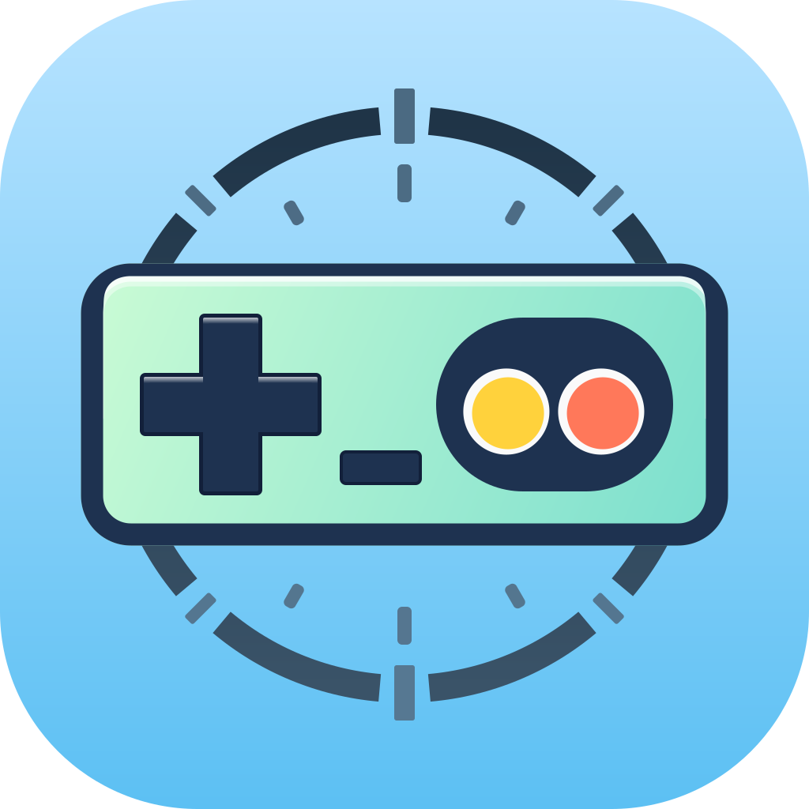

#  Nesium

  
  
  

[**English**](./README.md)

这是一个用 Rust 编写的周期精确 (cycle-accurate) NES 模拟器，旨在忠实还原任天堂娱乐系统 (NES) 的硬件行为。本项目致力于精确模拟 CPU、PPU、APU 等关键组件，确保每款游戏都能像在原始硬件上一样运行。

本模拟器的设计和实现深受优秀的 [Mesen2](https://github.com/SourMesen/Mesen2) 项目启发。Mesen2 的文档、代码结构以及许多实现思路（特别是在时序、Open-bus 行为和音频混合方面）都极具参考价值。非常感谢 Mesen2 的作者和贡献者们开发并开源了如此高质量的模拟器。

## 关键特性

- **周期精确模拟**：每一个时钟周期都经过精确模拟，以确保准确的游戏行为。
- **CPU (6502) 模拟**：完整模拟 6502 处理器，支持所有指令。
- **PPU 模拟**：精确的图形渲染，支持调色板、精灵和背景层。
- **APU 模拟**：重现声音处理，支持 NES 各个声道。
- **兼容性**：支持多种 NES 游戏，并持续改进兼容性和性能。

## UI 前端

本仓库目前提供 **两个** 前端实现：

- **`nesium-egui`** (`apps/nesium-egui`) — 一个基于 `egui` 构建的轻量级桌面前端。它占用资源少，提供**快速调试和开发**所需的基本功能。
  -   
- **`nesium-flutter`** (`apps/nesium_flutter`) — 一个基于 **Flutter** 构建的现代化前端。相比 `egui` 应用，它旨在提供更精美的 UI 和更广泛的跨平台支持。
  -     
- **Web 版本 (在线试玩)** — https://mikai233.github.io/nesium/ (通过高性能 **Flutter WASM (dart2wasm)** + Web Worker + Rust WASM 在浏览器中运行)。
  -  (Chrome/Edge 119+, Firefox 120+)

## 当前状态

- 处于活跃开发阶段，持续改进准确性、性能和兼容性。
- 仍处于早期阶段，但几个关键组件已经可以使用。

## 路线图

Nesium 的长期愿景专注于精确度、工具链和可扩展性：

- [ ] **精确的 NES 模拟**：
    实现 CPU、PPU 和 APU 组件的周期级精确度。目标是通过所有标准合规性测试套件（包括 `blargg` 测试和 `nes-test-roms` 中的棘手边缘情况），并正确支持“无授权”或依赖硬件缺陷的游戏。

- [ ] **高级调试套件**：
    在前端实现一个全面的调试器。计划的功能包括：
    - 实时反汇编和单步执行。
    - 内存检查/编辑（RAM, VRAM, OAM）。
    - 命名表（Nametable）、图案表（Pattern Table）和调色板查看器。
    - 断点管理（执行、读/写、IRQ）。

- [ ] **Lua 脚本集成**：
    嵌入 Lua 运行时以支持强大的自动化和分析功能。这将支持：
    - 工具辅助竞速（TAS）工作流。
    - 用于训练或直播的自定义 HUD 和覆盖层。
    - 自动化回归测试脚本。

- [ ] **联机游戏 (Netplay)**：
    实现互联网两名玩家的网络多人游戏支持。

## Mapper 支持

- [x] 0 – NROM
- [x] 1 – MMC1 (SxROM)
- [x] 2 – UxROM
- [x] 3 – CNROM
- [x] 4 – MMC3 (full IRQ + CHR/PRG/mirroring)
- [x] 5 – MMC5 (core features; ExRAM/nametable TODO)
- [x] 6 – Front Fareast Magic Card
- [x] 7 – AxROM
- [x] 8 – FFE GUI mode
- [x] 9 – MMC2
- [x] 10 – MMC4
- [x] 11 – Color Dreams
- [x] 13 – CPROM
- [x] 19 – Namco 163 (basic audio)
- [x] 21 – VRC4a/VRC4c
- [x] 23 – VRC2b/VRC4e
- [x] 25 – VRC4b/VRC4d/VRC2c
- [x] 26 – VRC6b (expansion audio stubbed; CHR-ROM nametable modes TODO)
- [x] 34 – BNROM / NINA-001
- [x] 66 – GxROM / GNROM
- [x] 71 – Camerica / Codemasters
- [x] 78 – Irem 74HC161/32 (Holy Diver) – simple IRQ/mirroring
- [x] 85 – VRC7 (audio stubbed; enable OPLL later)
- [x] 90 – JY Company multicart (simplified; advanced NT/IRQ behaviour TODO)
- [x] 119 – TQROM (MMC3 with CHR ROM/RAM bit) – verify against edge cases
- [x] 228 – Action 52 / Cheetahmen II

### Mapper 支持详情 / 已知问题

- **MMC5 (mapper 5)**: ExRAM 作为 nametable 的模式和扩展属性/填充特性尚未实现；扩展音频未实现。
- **Namco 163 (mapper 19)**: 仅实现了基本的音频路由；完整的 8 通道波表行为和每个通道的时序/相位包裹尚待完成。
- **VRC6b (mapper 26)**: 扩展音频仅实现了桩代码 (stubbed)；CHR-ROM nametable 模式未完成。
- **VRC7 (mapper 85)**: 音频核心尚未接入；OPLL 实现待定。
- **J.Y. Company 90**: 多合一卡带的 NT/IRQ 机制已简化；高级 nametable/IRQ 行为需要完善。
- **TQROM (mapper 119)**: 围绕 CHR ROM/RAM 位切换的边缘情况仍需验证。
- **Action 52 / Cheetahmen II (mapper 228)**: Mapper RAM 窗口行为实现非常基础；需针对所有卡带进行验证。
- **通用**: 针对某些离散板（如部分 UNROM/CNROM 变体）的总线冲突处理尚未完全建模。

## 测试 ROM 状态

Nesium 集成了大量的 NES 测试 ROM 套件（通过 `rom_suites.rs`）来验证 CPU、PPU、APU 和 Mapper 的行为。下表总结了目前自动通过的套件、需交互/手动测试的套件，以及目前标记为失败/忽略仍需工作的套件。

图例：

- ✅: 启用的自动化测试（无 `#[ignore]`）且当前通过
- ❌: 标记为 `#[ignore = "this test fails and needs investigation"]` 的测试
- 🔶: 交互式/手动 ROM（例如控制器/视觉测试）

### 自动通过的 ROM 套件 (✅)

| 套件名称 | 说明 | TASVideos 精度要求 |
| --- | --- | --- |
| `_240pee_suite` | TV 颜色多样性 / 时序测试 | 否 |
| `mmc1_a12_suite` | MMC1 A12 线行为 | 否 |
| `apu_mixer_suite` | APU 混音器 / TASVideos 测试集 | 是 |
| `apu_reset_suite` | APU 复位行为 | 是 |
| `blargg_apu_2005_07_30_suite` | 早期 Blargg APU 测试 | 是 |
| `blargg_nes_cpu_test5_suite` | CPU 精度测试 | 是 |
| `blargg_ppu_tests_2005_09_15b_suite` | PPU 调色板/显存/滚动行为 | 是 |
| `branch_timing_tests_suite` | 分支指令时序（零页结果） | 是 |
| `cpu_dummy_reads_suite` | CPU 伪读行为 | 是 |
| `cpu_dummy_writes_suite` | CPU 伪写行为 | 是 |
| `cpu_reset_suite` | 复位后 RAM/寄存器状态 | 是 |
| `cpu_timing_test6_suite` | TASVideos CPU 时序 (TV SHA1) | 是 |
| `dmc_dma_during_read4_suite` | DMC DMA 与 CPU 读取周期的交互 | 是 |
| `instr_misc_suite` | 杂项指令行为 | 是 |
| `instr_test_v3_suite` | Blargg 指令测试 v3 | 是 |
| `instr_test_v5_suite` | Blargg 指令测试 v5 | 是 |
| `instr_timing_suite` | 指令时序 | 是 |
| `nes_instr_test_suite` | 额外指令行为测试 | 是 |
| `ny2011_suite` | 视觉多样性 / 时序 | 否 |
| `oam_read_suite` | OAM 读取行为 | 是 |
| `oam_stress_suite` | OAM 压力 / 溢出条件 | 是 |
| `ppu_open_bus_suite` | PPU open-bus 行为 | 是 |
| `ppu_read_buffer_suite` | PPU 读取缓冲行为 | 是 |
| `ppu_vbl_nmi_suite` | PPU VBL/NMI 时序 | 是 |
| `sprite_hit_tests_2005_10_05_suite` | 精灵 0 命中时序和边缘情况 | 是 |
| `sprite_overflow_tests_suite` | 精灵溢出行为 | 是 |
| `spritecans_2011_suite` | 视觉多样性 / 精灵压力 | 否 |
| `stomper_suite` | 视觉多样性 / 时序 | 否 |
| `tutor_suite` | 视觉多样性 / 参考演示 | 否 |
| `vbl_nmi_timing_suite` | VBL/NMI 时序（零页结果） | 是 |
| `window5_suite` | 颜色窗口测试 (NTSC/PAL) | 否 |

### 交互式 / 手动 ROM (🔶)

这些 ROM 设计用于交互式/手动验证，并未暴露简单的 $6000 状态字节或 TV 哈希协议。它们被连接到测试工具中，但保持 `#[ignore]` 状态，应手动检查。

| 套件名称 | 说明 | TASVideos 精度要求 |
| --- | --- | --- |
| `paddletest3_manual` | 旋钮/模拟控制器测试；遵循 ROM `Info.txt` 指示 | 否 |
| `tvpassfail_manual` | TV 特性（NTSC 色度/亮度，伪影）；视觉验证 | 否 |
| `vaus_test_manual` | Arkanoid Vaus 控制器测试（交互式） | 否 |

### 失败 / 忽略的 ROM 套件 (❌)

以下套件目前标记为 `#[ignore = "this test fails and needs investigation"]`。这突出了 Nesium 的行为仍与参考模拟器和硬件有偏差的地方。

| 套件名称 | 说明 | TASVideos 精度要求 |
| --- | --- | --- |
| `apu_test_suite` | APU 精度测试（包括 `rom_singles`） | 是 |
| `blargg_litewall_suite` | Litewall / 时序相关测试 | 否 |
| `cpu_exec_space_suite` | CPU 执行空间测试 (APU/PPU I/O) | 是 |
| `cpu_interrupts_v2_suite` | NMI/IRQ/BRK/DMA 中断时序 | 是 |
| `dmc_tests_suite` | DMC 缓冲/延迟/IRQ 行为 | 是 |
| `dpcmletterbox_suite` | DPCM 相关视觉/音频测试 | 是 |
| `exram_suite` | MMC5 ExRAM 行为（当前失败） | 否 |
| `full_palette_suite` | 全调色板渲染和 Emphasis 测试 | 否 |
| `m22chrbankingtest_suite` | Mapper 22 CHR banking 行为 | 否 |
| `mmc3_irq_tests_suite` | MMC3 IRQ 行为 | 是 |
| `mmc3_test_suite` | MMC3/MMC6 功能测试 | 是 |
| `mmc3_test_2_suite` | 第二组 MMC3 测试集 | 是 |
| `mmc5test_suite` | MMC5 功能测试 | 是 |
| `mmc5test_v2_suite` | MMC5 测试集 v2 | 是 |
| `nes15_1_0_0_suite` | `nes15` 系列测试 (NTSC/PAL) | 是 |
| `nmi_sync_suite` | NMI 同步行为 | 是 |
| `nrom368_suite` | NROM-368 映射测试 | 否 |
| `other_suite` | nes-test-roms 绑定的杂项演示/测试 | 否 |
| `pal_apu_tests_suite` | PAL APU 行为 | 是 |
| `read_joy3_suite` | 控制器读取时序 | 是 |
| `scanline_suite` | 扫描线时序 | 是 |
| `scanline_a1_suite` | 替代扫描线测试 | 是 |
| `scrolltest_suite` | 滚动行为 | 是 |
| `sprdma_and_dmc_dma_suite` | Sprite DMA 和 DMC DMA 交互 | 是 |
| `volume_tests_suite` | 音量/混音行为 | 是 |

## 免责声明

本项目是一个由粉丝制作的非商业模拟器，旨在用于教育和保存目的。本项目与任天堂或其他权利方无关，亦未获得其认可或赞助。您需自行承担遵守当地法律的责任，并确保您在此模拟器中使用的任何 ROM 或其他受版权保护的内容均是通过合法途径获得和使用的（例如，来自您个人拥有的卡带）。

## 贡献

欢迎 Fork 本项目，提交 Issue 和 Pull Request。我们欢迎任何有助于提高模拟器准确性和扩展功能集的贡献。

## 许可证

Nesium 基于 GNU 通用公共许可证第 3 版或（由您选择）任何更高版本 (GPL-3.0-or-later) 发布。有关全文，请参阅 `LICENSE.md`。

本项目还包含 Shay Green 的 `blip_buf` 库（通过 `nesium-blip` crate 使用），该库根据 GNU 宽通用公共许可证 v2.1 授权。相关的许可证文本包含在 `crates/nesium-blip/csrc/license.md` 中的导入源码旁边。

## Libretro 绑定

本工作区包含 `libretro-bridge` crate，它通过 `bindgen` 自动为上游 `libretro.h`头文件生成 Rust 绑定。构建脚本会在编译时获取最新的头文件（对于离线构建有内置的回退），以便 Nesium——以及任何其他 Rust 项目——可以在 API 变更在上游发布后立即与 Libretro 生态系统集成。
